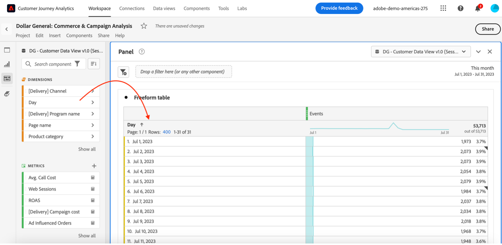
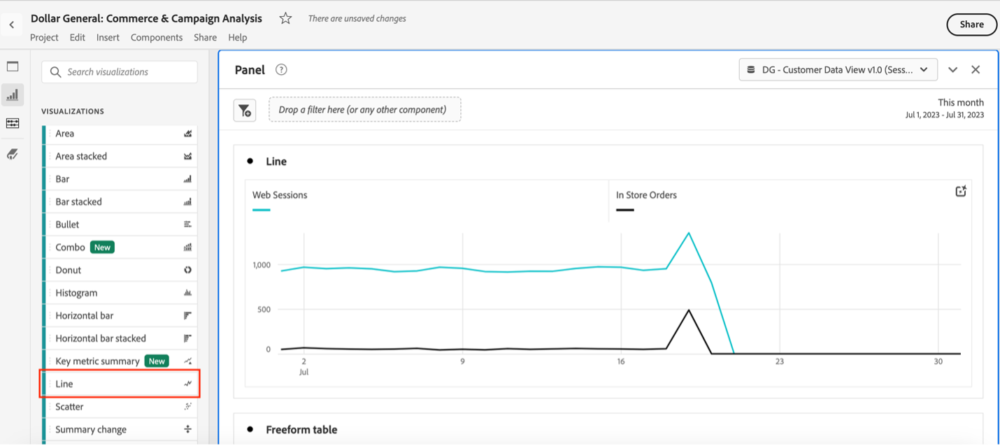
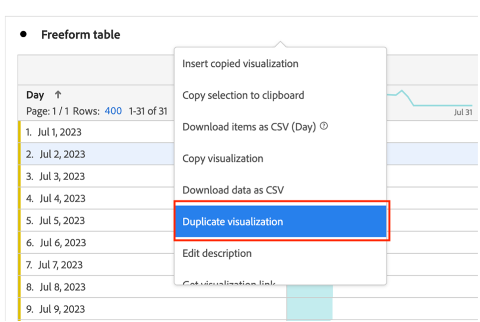
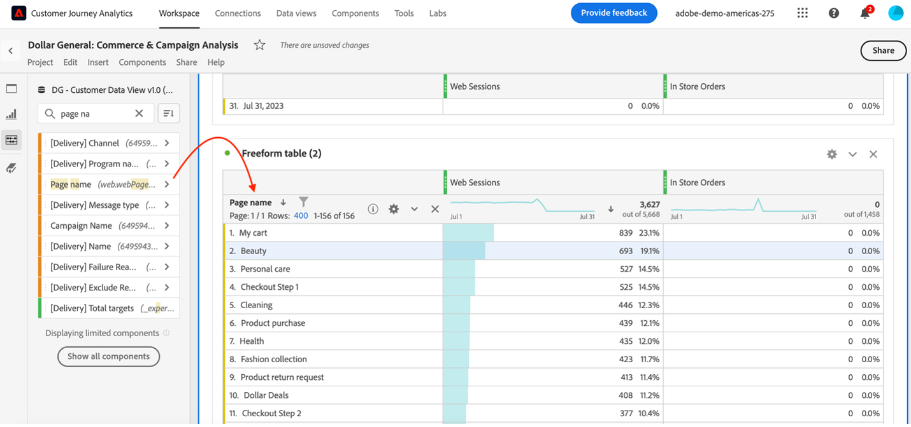
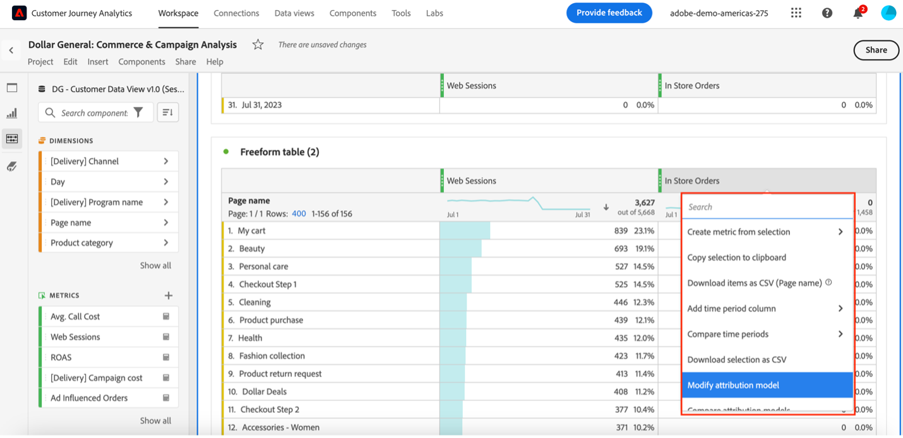
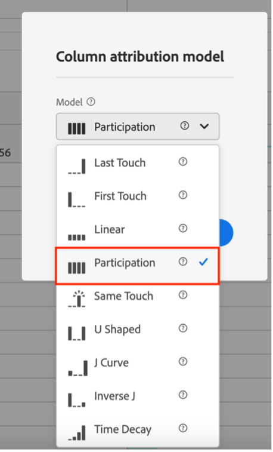
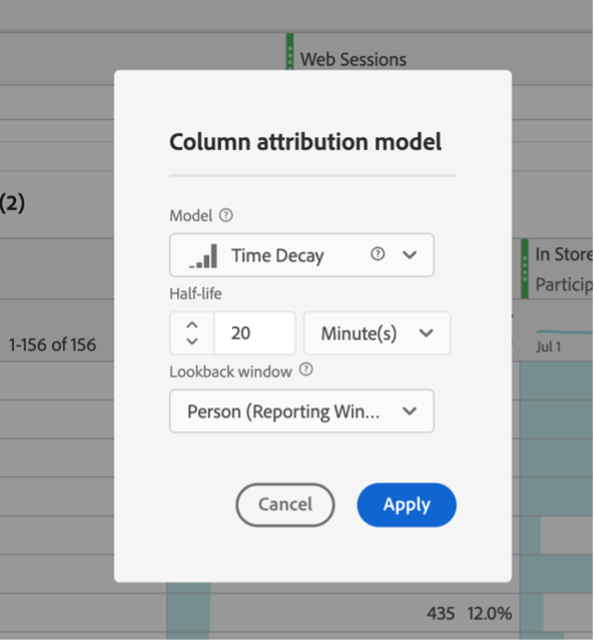
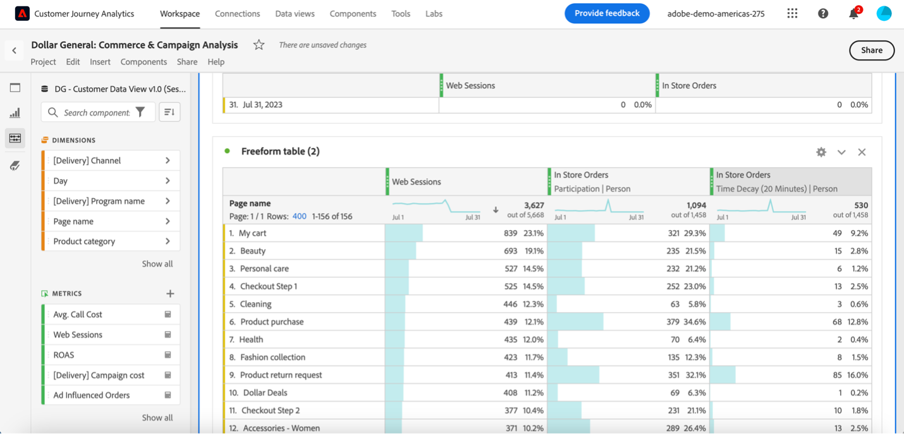
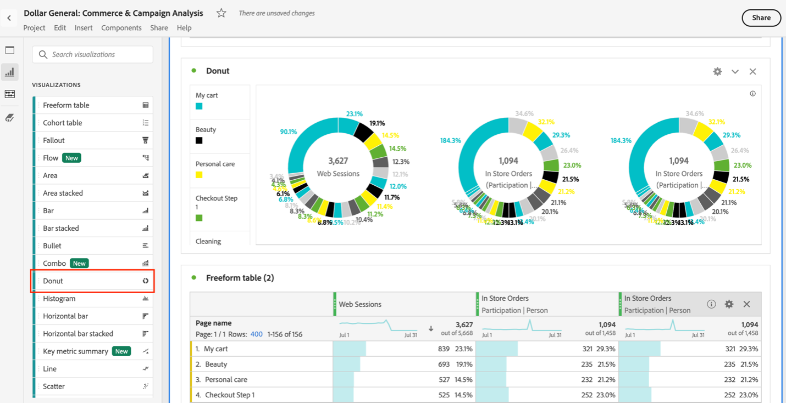
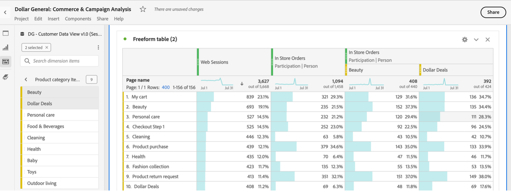

# Web to Store Journey

In this exercise we will create a couple of journeys of Top Pages Driving store purchases. You will need to build a Freeform Table to collect the event data. From there you will be able to build out several visualizations.&#x20;

This exercise will also require to set different attributions for each journey using Attribution IQ.

1. Create a "Freeform Table" by dragging the "Freeform Table" visualization into the panel. You can either create a new panel or you can drag the Freeform Table into the top of the "Welcome Customer Journey Analytics panel.
2.  Search for "Day" in the left-side navigation and drag-in the dimension into the Freeform table.

    <figure><figcaption></figcaption></figure>

3.  The drag in “Web Sessions” and then “In Store Orders” metrics onto that table to show the ability to use data from multiple datasets in a single visualization.\

    <figure><figcaption></figcaption></figure>

    <figure><figcaption></figcaption></figure>
4.  Drag a Line Visualization over to see the data trended over time visually. Select a particular day in the Day table to show how the Line Visualization updates to an Hourly trend line.

    <figure><figcaption></figcaption></figure>

    <figure><figcaption></figcaption></figure>
5.  Duplicate the Day Table(right click) and replace the Day dimension with the Web Page Name dimension in the new table.

    \

    <figure><figcaption></figcaption></figure>

    <figure><figcaption></figcaption></figure>
6. Show how you can see **Web Sessions** for each page but **In Store Order show 0.** This is because there are **no events** in the data that have **both a page interaction and a In Store event** in the same event (that would be impossible).
7.  Right click on the **In Store metric** and select **Modify Attribution Model** and change the model to a **Participation model** with a **Person Lookback Window**.

    <figure><figcaption></figcaption></figure>

    .png>)
8. Describe that this is showing the pages that customers look at prior to purchasing in store.
9.  Make a copy of the In Store metric column and **Modify Attribution Model again**, and this time select a **Time Decay model with a 20 minute Half-life and a Person Look-back Window.** Describe that this is now giving fractional credit to pages that customers **viewed in the 20 minutes prior to an in-store purchase.**\

    <figure><figcaption></figcaption></figure>

    \

    <figure><figcaption></figcaption></figure>
10. Add a Donut Visualization and make sure that it is tied to the Web Page Name table.

    <figure><figcaption></figcaption></figure>
11. Click the arrow to the right of the Product Category dimension in the Components menu to show the types of products that people are buying in store. Drag any of them under the In Store Order metric with the 20 minute Time Decay model in the Web Page Name table to segment the In Store Orders by those various Produce Categories.

    <figure><figcaption></figcaption></figure>

**Congratulations**, you have concluded this program.&#x20;

